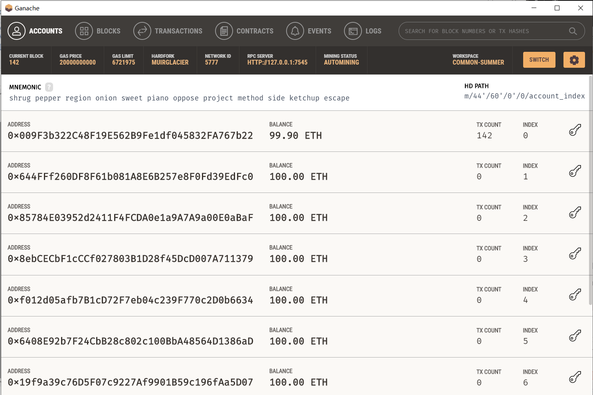
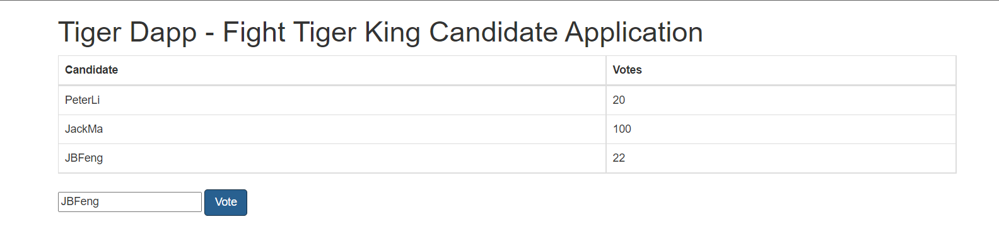

# Tiger Dapp

A Fight Tiger King Candidate Application


## Contract 

```java
pragma solidity ^0.4.22;
 
contract Voting {
 
    bytes32[] public candidateList;
    mapping (bytes32 => uint8) public votesReceived;
    
    constructor(bytes32[] candidateNames) public {
        candidateList = candidateNames;
    }
 
    function voteForCandidate(bytes32 candidate) public {
        require(validCandidate(candidate));
        votesReceived[candidate] += 1;
    }
 
    function totalVotesFor(bytes32 candidate) view public returns (uint8) {
        require(validCandidate(candidate));
        return votesReceived[candidate];
    }
 
    function validCandidate(bytes32 candidate) view public returns (bool) {
        for(uint8 i = 0; i < candidateList.length; i++) {
            if(candidateList[i] == candidate)
                return true;
        }
        return false;
    }
    
}
```
Deployment parameters [PeterLi，JackMa，JBFeng]
```js
var PeterLi = eb3.fromAscii('PeterLi')
```
```java
["0x50657465724c6900000000000000000000000000000000000000000000000000",
"0x4a61636b4d610000000000000000000000000000000000000000000000000000",
"0x4a4246656e670000000000000000000000000000000000000000000000000000"]
```

## Ganache




## Modify
You need to modify index.js
```js
web3 = new Web3(new Web3.providers.HttpProvider("HTTP://127.0.0.1:7545"));
abi = JSON.parse('[{"constant":false,"inputs":[{"name":"candidate","type":"bytes32"}],"name":"voteForCandidate","outputs":[],"payable":false,"stateMutability":"nonpayable","type":"function"},{"inputs":[{"name":"candidateNames","type":"bytes32[]"}],"payable":false,"stateMutability":"nonpayable","type":"constructor"},{"constant":true,"inputs":[{"name":"","type":"uint256"}],"name":"candidateList","outputs":[{"name":"","type":"bytes32"}],"payable":false,"stateMutability":"view","type":"function"},{"constant":true,"inputs":[{"name":"candidate","type":"bytes32"}],"name":"totalVotesFor","outputs":[{"name":"","type":"uint8"}],"payable":false,"stateMutability":"view","type":"function"},{"constant":true,"inputs":[{"name":"candidate","type":"bytes32"}],"name":"validCandidate","outputs":[{"name":"","type":"bool"}],"payable":false,"stateMutability":"view","type":"function"},{"constant":true,"inputs":[{"name":"","type":"bytes32"}],"name":"votesReceived","outputs":[{"name":"","type":"uint8"}],"payable":false,"stateMutability":"view","type":"function"}]');
VotingContract = web3.eth.contract(abi);
 
//部署的合约地址 
contractInstance = VotingContract.at('0x3DE61c2908Aa542d324c9D18f5BE0CF54b00F9C8');
 
candidates = {"PeterLi": "candidate-1","JackMa": "candidate-2","JBFeng":"candidate-3"}

```

## Start

